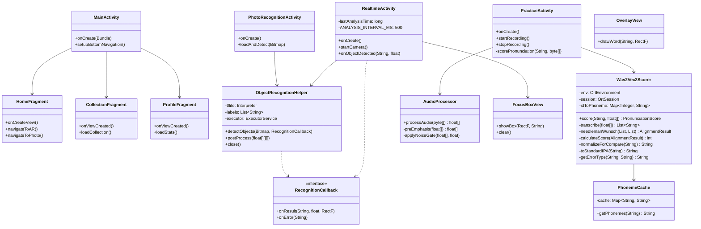
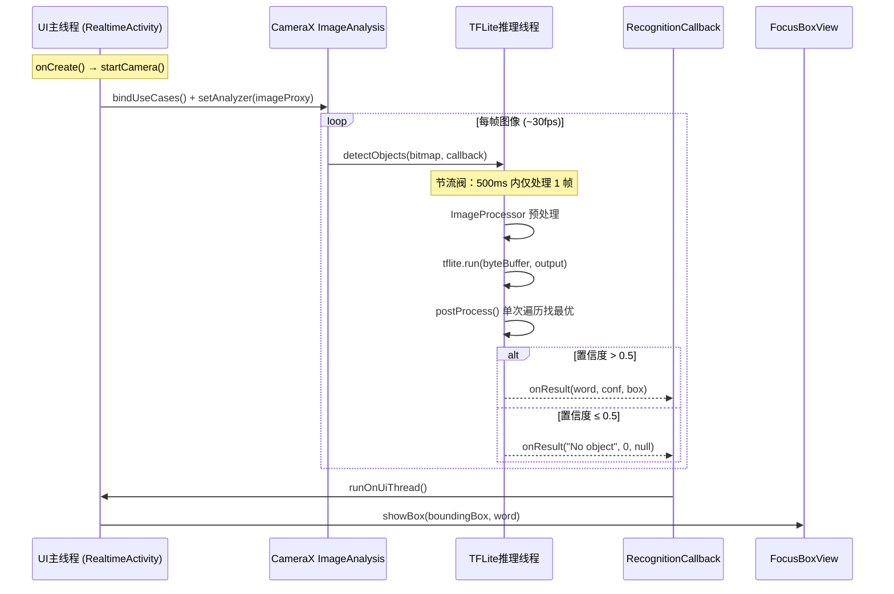
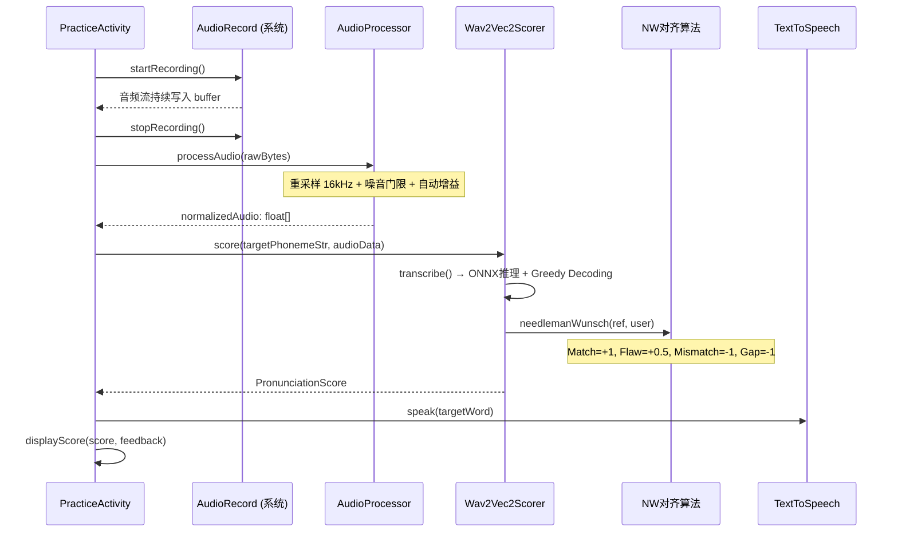
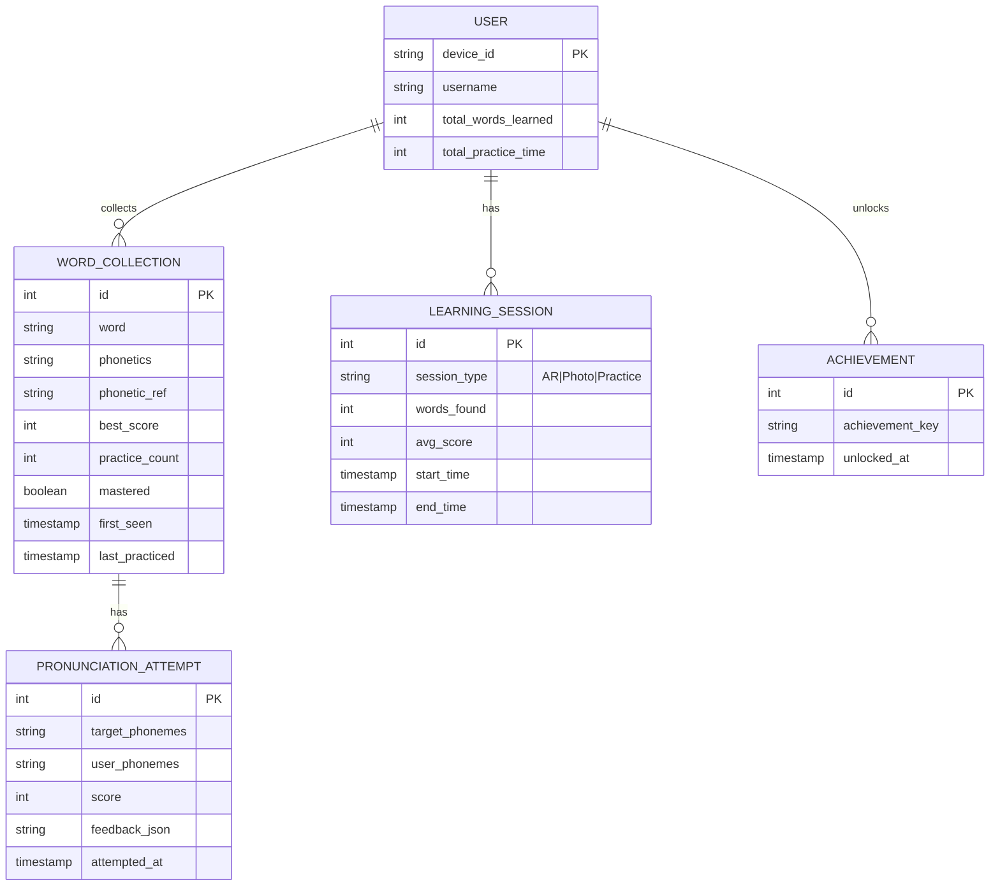

# VisionVoice 软件架构设计文档

> **项目名称**：VisionVoice — AR英语学习应用
> **文档编号**：SAD-001
> **版本**：v1.0
> **作者**：宋姚博涵
> **日期**：2026-03-23
> **状态**：🟡 初稿

---

## 第1章 文档概述

### 1.1 文档目的

本文档旨在全面描述 **VisionVoice** 安卓应用的软件架构设计，为开发团队提供技术实现指导，为未来维护和扩展提供架构依据。文档基于 **IEEE 1471 / ISO/IEC 42010** 国际架构描述标准组织内容。

### 1.2 项目范围与边界

| 项目 | 内容 |
|------|------|
| **系统名称** | VisionVoice |
| **系统类型** | Android 移动应用（AR + AI） |
| **核心功能** | AR实时物体识别、英语单词学习、口语发音评分、单词收藏管理 |
| **目标用户** | 英语学习者（青少年及成人），尤其是需要扩充视觉词汇量的学习者 |
| **项目阶段** | 已完成 V1.1，发表 IEEE APCCAS 2024 论文 |
| **团队规模** | 1人（个人项目） |
| **上线状态** | 已完成原型开发，具备完整演示能力 |

**边界定义**：
- ✅ **包含**：Android 主应用、后端评分 API（可选本地部署）
- ❌ **不包含**：线上服务器、用户账号系统、云端同步、多语言支持

### 1.3 利益相关方

| 利益相关方 | 角色 | 关注点 |
|------------|------|--------|
| 开发者/所有者 | 宋姚博涵 | 技术可行性、可维护性、架构扩展性 |
| 最终用户 | 英语学习者 | 识别准确率、发音评分合理性、用户体验流畅度 |
| 学术评审 | IEEE APCCAS 2024 审稿人 | 技术创新性、架构合理性、实验完整性 |
| 未来协作者 | 扩展功能开发者 | 代码可读性、模块边界清晰度 |

### 1.4 定义与缩写

| 缩写 | 全称 | 定义 |
|------|------|------|
| **AR** | Augmented Reality | 增强现实，在摄像头画面上叠加虚拟信息 |
| **TFLite** | TensorFlow Lite | Google 移动端机器学习推理框架 |
| **ONNX** | Open Neural Network Exchange | 跨框架模型交换格式 |
| **YOLO** | You Only Look Once | 实时目标检测算法 |
| **Wav2Vec2** | Waveform-to-Vector 2 | Meta 开源的自监督语音表示模型 |
| **IPA** | International Phonetic Alphabet | 国际音标 |
| **Arpabet** | ARPABET | CMU 发明的英语音素标注系统（如 /AE/ = 梅花音） |
| **CameraX** | CameraX | Android Jetpack 相机 API |
| **TTS** | Text-To-Speech | 文本转语音 |
| **ASR** | Automatic Speech Recognition | 自动语音识别 |
| **SRP** | Single Responsibility Principle | 单一职责原则 |
| **DRY** | Don't Repeat Yourself | 不要重复原则 |
| **NN** | Needleman-Wunsch Algorithm | 序列比对算法，用于音素对齐 |

---

## 第2章 约束条件

### 2.1 技术约束

| 约束类型 | 约束内容 | 技术依据 |
|----------|----------|----------|
| **编程语言** | Java 11（主代码）/ Kotlin 1.x（部分组件如 YoloDetector） | Android 生态主流选择 |
| **SDK 版本** | minSdk = 24，targetSdk = 34，compileSdk = 36 | 平衡覆盖率和最新 API |
| **相机 API** | CameraX 1.3.1 | Jetpack 官方推荐，稳定可靠 |
| **物体检测模型** | YOLOv8n.tflite（TFLite Interpreter API） | 模型缺少元数据，无法使用高级 ObjectDetector API |
| **语音评分模型** | Wav2Vec2 ONNX（ONNX Runtime Mobile 1.17.0） | 端侧离线推理，保护隐私 |
| **物体识别框架** | TensorFlow Lite 2.10.0 + TFLite Support 0.4.3 | 底层 Interpreter API |
| **网络请求** | OkHttp 4.12.0 | 轻量、兼容性好 |
| **模型文件存储** | assets/ 目录 + 内部 FilesDir | 模型 ~5MB（YOLO）+ ~50MB（ONNX） |
| **音频格式** | WAV（录音原始 PCM） | 无压缩，保留完整音频特征 |
| **音频采样率** | 16kHz（模型输入要求） | Wav2Vec2 模型标准输入采样率 |

### 2.2 业务约束

| 约束类型 | 约束内容 |
|----------|----------|
| **离线优先** | 核心功能（识别+评分）必须支持纯离线运行 |
| **低延迟** | 实时识别帧率目标：≥2 FPS（节流至 500ms/次） |
| **隐私保护** | 用户录音不离开设备（端侧推理） |
| **APK 体积** | 目标 < 100MB（含所有模型） |

### 2.3 组织与流程约束

| 约束类型 | 约束内容 |
|----------|----------|
| **开发流程** | 个人项目，快速迭代 |
| **代码规范** | 遵循 Android 官方 Java 编码规范 |
| **文档要求** | 每次重大架构变更更新本 SAD |
| **发布方式** | 直接 APK 安装（暂不上架应用商店） |

---

## 第3章 架构视图

### 3.1 逻辑架构

#### 3.1.1 视点说明

| 项目 | 内容 |
|------|------|
| **视点名称** | 功能组织视点 |
| **关注问题** | 系统提供哪些核心业务功能？模块职责如何划分？ |
| **目标读者** | 产品负责人、技术评审者、未来开发者 |
| **表示法** | UML 类图 + 包结构 + 文字说明 |

#### 3.1.2 核心模块职责

| 模块/包名 | 英文名 | 核心职责 | 关键类/接口 |
|-----------|--------|----------|-------------|
| 🖼️ AR 实时识别 | AR Recognition | 摄像头实时物体检测 + AR 单词叠加显示 | `RealtimeActivity`, `ObjectRecognitionHelper`, `FocusBoxView` |
| 🖼️ 照片识别 | Photo Recognition | 相册图片物体检测（非实时） | `PhotoRecognitionActivity`, `ObjectRecognitionHelper` |
| 🎤 发音练习 | Pronunciation Practice | 录音采集 + 音素提取 + 评分 + TTS 示范 | `PracticeActivity`, `Wav2Vec2Scorer`, `AudioProcessor` |
| 📚 单词收藏 | Word Collection | 收藏夹管理、学习统计、成就系统 | `CollectionFragment`, `ProfileFragment` |
| 🏠 首页 | Home | 入口导航、快速开始学习 | `HomeFragment` |
| 🤖 ML 核心 | ML Core | TFLite/YOLO 推理、ONNX/Wav2Vec2 推理、音素对齐算法 | `ObjectRecognitionHelper`, `Wav2Vec2Scorer`, `PhonemeCache`, `AudioProcessor` |

#### 3.1.3 核心类设计



#### 3.1.4 模块接口定义

| 接口 | 所属模块 | 方法签名 | 说明 |
|------|----------|----------|------|
| `RecognitionCallback` | ML Core | `onResult(word, confidence, boundingBox)` | 物体检测结果回调 |
| `RecognitionCallback` | ML Core | `onError(message)` | 检测错误回调 |
| `PronunciationScore` | ML Core | `score, referencePhonemes, userPhonemes, feedback` | 发音评分数据结构 |
| `AlignmentResult` | ML Core | `reference, user, feedback` | 音素对齐结果 |

---

### 3.2 开发架构

#### 3.2.1 目录结构

```
MyApplication/
├── app/
│   └── src/main/
│       ├── java/com/example/myapplication/
│       │   ├── ml/                        # 机器学习核心
│       │   │   ├── ObjectRecognitionHelper.java    # TFLite YOLO 推理引擎
│       │   │   ├── Wav2Vec2Scorer.java              # ONNX 音素评分引擎
│       │   │   ├── AudioProcessor.java             # 音频预处理
│       │   │   ├── PhonemeCache.java               # 音标缓存
│       │   │   └── README.md                        # ML 模块设计笔记
│       │   ├── ui/                        # Android UI 层
│       │   │   ├── main/MainActivity.java           # 单入口 + BottomNavigation
│       │   │   ├── home/HomeFragment.java           # 首页导航
│       │   │   ├── ar/RealtimeActivity.java        # AR 实时识别页
│       │   │   ├── photo/PhotoRecognitionActivity.java # 照片识别页
│       │   │   ├── practice/PracticeActivity.java   # 发音练习页
│       │   │   ├── collection/CollectionFragment.java # 单词收藏夹
│       │   │   ├── profile/ProfileFragment.java     # 个人资料/成就
│       │   │   └── test/OnnxTestActivity.java       # ONNX 测试页
│       │   └── view/                    # 自定义 View
│       │       ├── FocusBoxView.java             # 焦点框绘制
│       │       └── OverlayView.java              # 单词叠加层
│       ├── assets/                     # 模型文件
│       │   ├── yolov8n.tflite                   # YOLOv8nano (~5MB)
│       │   ├── labels.txt                       # 40类物体标签
│       │   ├── cmudict_ar_pro.dict              # CMU 发音词典
│       │   └── onnx/
│       │       ├── model.onnx                   # Wav2Vec2 完整模型
│       │       └── model_quant.onnx             # 量化模型（优先使用）
│       └── AndroidManifest.xml
├── backend/                        # Python 后端（可选）
│   ├── server.py                    # FastAPI 主服务
│   ├── WavReal.py                   # Wav2Vec2 核心推理
│   ├── export_true_onnx.py         # ONNX 模型导出
│   └── test_model.py                # 模型测试脚本
├── docs/                           # 项目文档
│   └── architecture/
│       └── SAD.md                   # 本文档
├── graphics/                       # 图表资源
├── build.gradle.kts               # Gradle 构建配置
└── README.md
```

#### 3.2.2 分层架构

```
┌─────────────────────────────────────────────────────────────┐
│                   UI Layer（表现层）                           │
│  Activity / Fragment / Custom View / XML Layout             │
├─────────────────────────────────────────────────────────────┤
│                 Application Layer（应用层）                    │
│  Activity 业务逻辑、页面编排、生命周期管理                      │
├─────────────────────────────────────────────────────────────┤
│                    ML Layer（机器学习层）                       │
│  ObjectRecognitionHelper / Wav2Vec2Scorer / AudioProcessor  │
│  特点：纯 Java 实现，无 Android 直接依赖                       │
├─────────────────────────────────────────────────────────────┤
│                 Infrastructure Layer（基础设施层）               │
│  CameraX / TTS / MediaRecorder / Assets / OkHttp           │
└─────────────────────────────────────────────────────────────┘
```

---

### 3.3 进程架构

#### 3.3.1 线程模型

| 线程/进程 | 类型 | 职责 | 管理方式 |
|-----------|------|------|----------|
| **UI 主线程** | Android Main Thread | UI 渲染、用户输入响应 | Android Framework |
| **CameraX 分析线程** | CameraX Internal | 捕获摄像头帧，`ImageAnalysis.Analyzer` 回调 | CameraX 内部管理 |
| **TFLite 推理线程** | `ExecutorService` 单线程池 | 执行 YOLO 推理（CPU 密集型） | `ObjectRecognitionHelper` 生命周期管理 |
| **ONNX 推理线程** | `OrtEnvironment` 内部 | 执行 Wav2Vec2 推理 | ONNX Runtime 内部管理 |
| **AudioRecord 线程** | Android System | 采集麦克风 PCM 音频 | 系统管理 |

#### 3.3.2 关键流程时序

**实时识别流程**：



**发音评分流程**：



---

### 3.4 物理/部署架构

#### 3.4.1 部署拓扑

```
┌──────────────────────────────────────────────────────────────┐
│                    Android Device                             │
│                                                              │
│  ┌────────────────────────────────────────────────────────┐  │
│  │                   VisionVoice APK                        │  │
│  │                                                         │  │
│  │  ┌─────────────┐  ┌─────────────┐  ┌───────────────┐  │  │
│  │  │ CameraX     │  │ TensorFlow   │  │ ONNX Runtime  │  │  │
│  │  │ Camera HAL  │  │ Lite 2.10.0  │  │ Mobile 1.17.0  │  │  │
│  │  └──────┬──────┘  └──────┬──────┘  └───────┬───────┘  │  │
│  │         │                │                   │          │  │
│  │         │         ┌──────▼──────┐            │          │  │
│  │         │         │ YOLOv8n     │     ┌──────▼──────┐  │  │
│  │         │         │ .tflite     │     │ Wav2Vec2     │  │  │
│  │         │         │ (Assets)    │     │ model_quant  │  │  │
│  │         │         └─────────────┘     │ .onnx        │  │  │
│  │         │                            └──────────────┘  │  │
│  │         │                                       │       │  │
│  │  ┌──────▼───────────────────────────────────────▼────┐ │  │
│  │  │                  ML Pipeline                      │ │  │
│  │  │  [Camera] → [YOLO检测] → [标签映射] → [AR叠加]   │ │  │
│  │  │  [Mic] → [音频处理] → [Wav2Vec2] → [NW对齐] → [评分]│ │  │
│  │  └───────────────────────────────────────────────────┘ │  │
│  └────────────────────────────────────────────────────────┘  │
│                                                              │
│  ┌────────────────────────────────────────────────────────┐  │
│  │              后端服务（可选本地部署）                     │  │
│  │  FastAPI (Python) + uvicorn on localhost:8000          │  │
│  └────────────────────────────────────────────────────────┘  │
└──────────────────────────────────────────────────────────────┘
```

#### 3.4.2 资源清单

| 资源类型 | 文件名 | 大小 | 位置 |
|----------|--------|------|------|
| YOLO 模型 | `yolov8n.tflite` | ~6 MB | `assets/` |
| Wav2Vec2 量化模型 | `model_quant.onnx` | ~50 MB | `assets/onnx/` |
| 标签文件 | `labels.txt`（40类） | ~300 B | `assets/` |
| CMU 词典 | `cmudict_ar_pro.dict` | ~2 MB | `assets/` |
| APK 总体积 | Release build | < 100 MB | 输出目录 |
| 运行时内存峰值 | 实时识别 | ~200 MB | 设备 RAM |
| 最低设备要求 | Android 7.0+ | 2GB RAM / API 24 | — |

---

## 第4章 数据架构

### 4.1 数据模型（规划）

> ⚠️ **v1.1 尚未实现持久化存储**，以下为未来规划方案。



### 4.2 存储策略规划

| 数据类型 | 当前 | 规划方案 |
|----------|------|----------|
| 收藏单词 | ❌ 仅内存 | Room SQLite |
| 学习统计 | ❌ 仅内存 | Room + DataStore |
| 成就记录 | ❌ 仅内存 | Room |
| 录音文件 | ❌ 临时文件 | 即删（隐私保护）|
| 音标缓存 | ✅ 内存 `PhonemeCache` | 持久化 LRU 缓存 |

---

## 第5章 关键架构决策（ADR）

### ADR-001：采用 TFLite Interpreter API 而非高级 ObjectDetector API

| 项目 | 内容 |
|------|------|
| **编号** | ADR-001 |
| **标题** | 放弃 TFLite 高级 API，拥抱底层 Interpreter API |
| **状态** | ✅ 已接受（v1.0） |

**背景**：YOLOv8n.tflite 模型缺少 `NormalizationOptions` 元数据，导致 `ObjectDetector` 高级 API 崩溃。

**决策**：切换到底层 `Interpreter` API，手动实现图像预处理和后处理。

**后果**：
- ✅ 成功适配"非标准"模型，获得对推理流程的完全控制
- ✅ 性能优化空间更大（单次遍历 O(N) vs 转置后遍历 O(2N)）
- ⚠️ 代码量增加，需自行处理坐标系转换

---

### ADR-002：端侧 Wav2Vec2 离线发音评分

| 项目 | 内容 |
|------|------|
| **编号** | ADR-002 |
| **标题** | ONNX Runtime Mobile 替代云端 API |
| **状态** | ✅ 已接受（v1.1） |

**决策**：使用 ONNX Runtime Mobile 在设备端运行 Wav2Vec2 量化模型（`model_quant.onnx`，~50MB）。

**后果**：
- ✅ 零网络依赖，保护用户隐私
- ✅ 评分延迟 < 1秒
- ⚠️ APK 体积增加约 50MB
- ⚠️ 部分低端设备推理性能不足

---

### ADR-003：节流阀解决实时识别闪烁

| 项目 | 内容 |
|------|------|
| **编号** | ADR-003 |
| **标题** | 500ms Throttling + 单次遍历后处理 |
| **状态** | ✅ 已接受（v1.1 优化） |

**决策**：在 `RealtimeActivity` 中引入时间戳节流阀 + 重构 `postProcess` 为单次遍历。

**后果**：
- ✅ 识别帧率稳定在 ~2 FPS，UI 平滑不闪烁
- ✅ CPU 平均负载显著降低

---

### ADR-004：ML 逻辑抽离为独立 Helper 类

| 项目 | 内容 |
|------|------|
| **编号** | ADR-004 |
| **标题** | ObjectRecognitionHelper — UI 与 ML 解耦 |
| **状态** | ✅ 已接受（v1.1 重构） |

**决策**：遵循 SRP + DRY，将所有 ML 逻辑封装到 `ObjectRecognitionHelper`，通过 `RecognitionCallback` 异步回调。

**后果**：
- ✅ `RealtimeActivity` 和 `PhotoRecognitionActivity` 完全复用同一 Helper
- ✅ ML 模块可独立测试
- ✅ 代码量减少约 40%

---

## 第6章 质量属性分析

| 质量属性 | 目标 | 实现策略 |
|----------|------|----------|
| **🎯 功能适用性** | 40类物体稳定识别 | YOLOv8n + CameraX |
| **⚡ 性能效率** | 识别延迟 < 500ms | 节流阀 + 单次遍历 |
| **📶 兼容性** | Android 7.0+（API 24+） | minSdk=24 |
| **🖐️ 易用性** | 单手操作，3步内完成学习 | BottomNav + FAB |
| **🔒 可靠性** | 无崩溃，内存不泄漏 | 资源严格释放 + 异常捕获 |
| **🔐 安全性** | 录音不离开设备 | 端侧 ONNX 推理 |
| **🔧 可维护性** | 模块间松耦合 | Helper 类 + 接口回调 |
| **📱 可移植性** | ML 核心可抽取为独立库 | 纯 Java ML 层 |

---

## 第7章 风险评估

| 风险 | 可能性 | 影响 | 等级 | 缓解策略 |
|------|--------|------|------|----------|
| 低端设备（< 2GB RAM）ONNX 推理 OOM | 中 | 高 | 🔴 | 更激进的量化模型，或切换到后端 API |
| 复杂背景下 YOLO 识别准确率下降 | 中 | 中 | 🟡 | 增加训练数据或切换 YOLOv8s |
| 40类标签有限，部分物体无对应单词 | 高 | 低 | 🟡 | 建立标签-单词映射表，人工审核 |
| Android 不同厂商 CameraX 行为不一致 | 低 | 中 | 🟡 | CameraX 1.3.1 覆盖主流设备 |

---

## 第8章 参考资料

| 编号 | 引用 | 来源 |
|------|------|------|
| 1 | IEEE 1471 / ISO 42010 | 架构描述国际标准 |
| 2 | 4+1 View Model — Kruchten 1995 | IEEE Software |
| 3 | TensorFlow Lite 官方文档 | tensorflow.org/lite |
| 4 | ONNX Runtime Mobile | onnxruntime.ai |
| 5 | Wav2Vec2 — facebook/wav2vec2-lv-60-espeak-cv-ft | HuggingFace |
| 6 | YOLOv8 — Ultralytics | github.com/ultralytics |
| 7 | ARIELLE Paper — IEEE APCCAS 2024 | 项目同名论文 |
| 8 | ISO/IEC 25010 | 软件质量模型标准 |

---

*本文档随 VisionVoice 项目迭代同步更新。每次重大架构变更须新建 ADR 并更新本 SAD 对应章节。*
*最后更新：2026-03-23 by OpenClaw AI Assistant*
